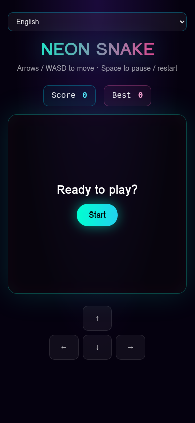

# 🐍 Neon Snake

A modern, neon-cyberpunk reimagining of the classic Snake game — built for the browser, playable in 10 languages, no download required.

🎮 **Play now:** [gleeful-garden-game.lovable.app](https://gleeful-garden-game.lovable.app)



---

## ✨ Features

- 🌃 **Neon cyberpunk aesthetic** — glowing visuals, smooth animations
- 🌍 **10 languages** — English, 中文, 日本語, 한국어, Deutsch, Italiano, Français, Español, Bahasa, Polski
- ⌨️ **Desktop controls** — Arrow keys / WASD
- 📱 **Mobile controls** — Swipe gestures
- 🏆 **Local high score** — beat your best
- ⚡ **Zero install** — runs instantly in any modern browser
- 🆓 **100% free** — no signup, no ads

---

## 🛠 Tech Stack

- **Framework:** [TanStack Start](https://tanstack.com/start) (React 19 + Vite 7)
- **Styling:** Tailwind CSS v4
- **Runtime:** Cloudflare Workers (edge)
- **Promo video:** [Remotion](https://www.remotion.dev/) (see `remotion/`)
- **Built with:** [Lovable](https://lovable.dev)

---

## 🚀 Local Development

```bash
# Install dependencies
bun install

# Start dev server
bun dev
```

Then open [http://localhost:5173](http://localhost:5173).

---

## 🎥 Promo Video

A 12s square promo video lives in the `remotion/` folder. To render:

```bash
cd remotion
bun install
bun run scripts/render-remotion.mjs
```

Output: `/mnt/documents/neon-snake-promo.mp4`

---

## 📦 Project Structure

```
src/
├── routes/          # File-based routing (TanStack Start)
│   ├── __root.tsx   # Root layout
│   └── index.tsx    # Game page
├── components/ui/   # shadcn/ui components
└── styles.css       # Tailwind + design tokens

remotion/            # Promo video composition
```

---

## 📄 License

MIT — feel free to remix, fork, and share.

---

Made with 💚 using [Lovable](https://lovable.dev)
